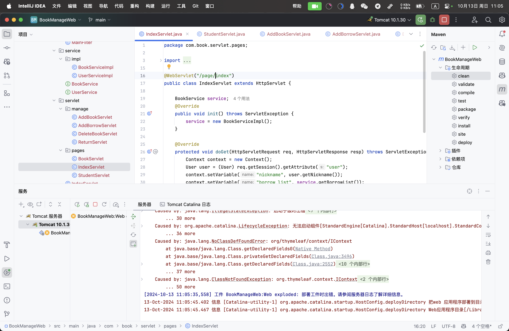

# Book_Manage_Web
图书馆管理系统，带web页面

> 前端模版是真的难找啊，大部分是收费的，免费的已经是凤毛麟角了。
>
> Copyright 2021 © SplashDash All Rights By [bootstrapmb](http://www.bootstrapmb.com/).
>
> 额，好像本身就是付费模版

技术栈：

- Mybaits
- Servlet
- Thymeleaf
- Tomcat

> 将数据库查询的操作和结构融入到前端页面中

## 1.前端模版资源寻找

从教学中的资源将前端页面拉取过来，按照相同的路径保存即可。

启动Tomcat，代理下webapp中的静态页面查看效果。


放到resources目录下实现Servlet直接代理相关页面

## 2.创建数据库

直接使用之前的数据库book_manage添加admin表即可

一次选择多张表即可可以一次将多个表转换为模型


## 3.编写初始Servlet实现直接代理静态网页

编写的LoginServlet如下：

```java
package org.mobai.servlet;

import jakarta.servlet.ServletException;
import jakarta.servlet.annotation.WebServlet;
import jakarta.servlet.http.HttpServlet;
import jakarta.servlet.http.HttpServletRequest;
import jakarta.servlet.http.HttpServletResponse;
import org.mobai.utils.ThymeleafUtil;
import org.thymeleaf.context.Context;

import java.io.IOException;

@WebServlet("/login")
public class LoginServlet extends HttpServlet {
  @Override
    protected void doGet(HttpServletRequest req, HttpServletResponse resp) throws ServletException, IOException {
    ThymeleafUtil.process("login.html", new Context(), resp.getWriter());
    }
}
```

问题如下：


> Java类资源找不到

即使单独添加lib到库依旧报错

> 像这种初始即报错算是一种痛苦了
>
> 尝试了多种方式问题依旧

## 4.移植项目依旧报错



> 依旧找不到类，发生同样的异常。

项目结构如下：

src

```bash
.
├── java
│   └── com
│       └── book
│           ├── dao															-- 数据库操作映射接口
│           │   ├── BookMapper.java	
│           │   ├── StudentMapper.java
│           │   └── UserMapper.java
│           ├── entity													-- 数据库实体模型
│           │   ├── Book.java
│           │   ├── Borrow.java
│           │   ├── Student.java
│           │   └── User.java
│           ├── filter													-- 资源过滤器
│           │   └── MainFilter.java
│           ├── service												  -- 业务逻辑层和实现	
│           │   ├── BookService.java
│           │   ├── UserService.java         
│           │   └── impl         
│           │       ├── BookServiceImpl.java
│           │       └── UserServiceImpl.java
│           ├── servlet													-- servlet功能，这里调用dao中的方法
│           │   ├── IndexServlet.java
│           │   ├── LoginServlet.java
│           │   ├── auth
│           │   │   ├── LoginServlet.java
│           │   │   └── LogoutServlet.java
│           │   ├── manage
│           │   │   ├── AddBookServlet.java
│           │   │   ├── AddBorrowServlet.java
│           │   │   ├── DeleteBookServlet.java
│           │   │   └── ReturnServlet.java
│           │   └── pages
│           │       ├── BookServlet.java
│           │       ├── IndexServlet.java
│           │       └── StudentServlet.java
│           └── utils                						-- 工件
│               ├── MybatisUtil.java
│               └── ThymeleafUtil.java
└── resources
    ├── add-book.html
    ├── add-borrow.html
    ├── books.html
    ├── header.html
    ├── index.html
    ├── login.html
    ├── mybatis-config.xml
    └── students.html
```

web下项目结构如下：

```bash
.
├── WEB-INF
├── lib
└── static
    ├── css
    ├── font
    ├── image
    ├── js
    └── picture
```

> 教学视频还是可以看一下，不然还是不太理解Service这个包的作用

项目架构依旧跑不起来，暂且搁置了。

解释下java中final的基本用法：

- **`final` 类**：不能被继承。
- **`final` 方法**：不能被重写。
- **`final` 变量**：只能被赋值一次。
- **`final` 引用类型**：引用本身不能改变，但引用的对象内容可以改变。

关于第四点比如创建了一个List<Interger>ml;

那么不管在什么方法中ml的地址不能改变，即引用对象不发生改变，但是其内部是可以使用add函数添加内容的。
